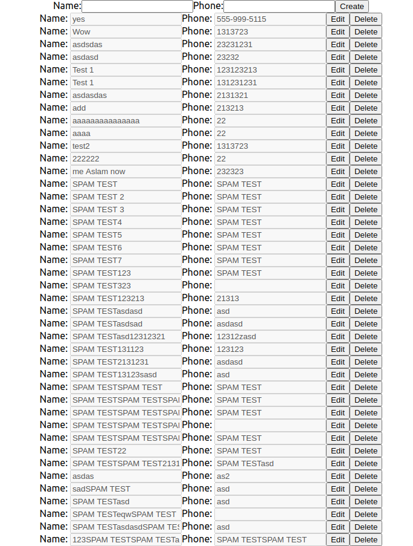

# Project 12B: FaunaDB Crud Serverless

[Deployment to Netlify](https://eru-fauna-crud.netlify.app/)

This is meant to be a display of a frontend with basic CRUD capabilities via a serverless faunaDB backend. The items here are basic phonebook contacts. Which can be Created, Updated (edited), Read(displayed) and Deleted. All actions update the database as visible by reloading the page. This is not meant to be a display of CSS so it looks very basic.

# Demo:

